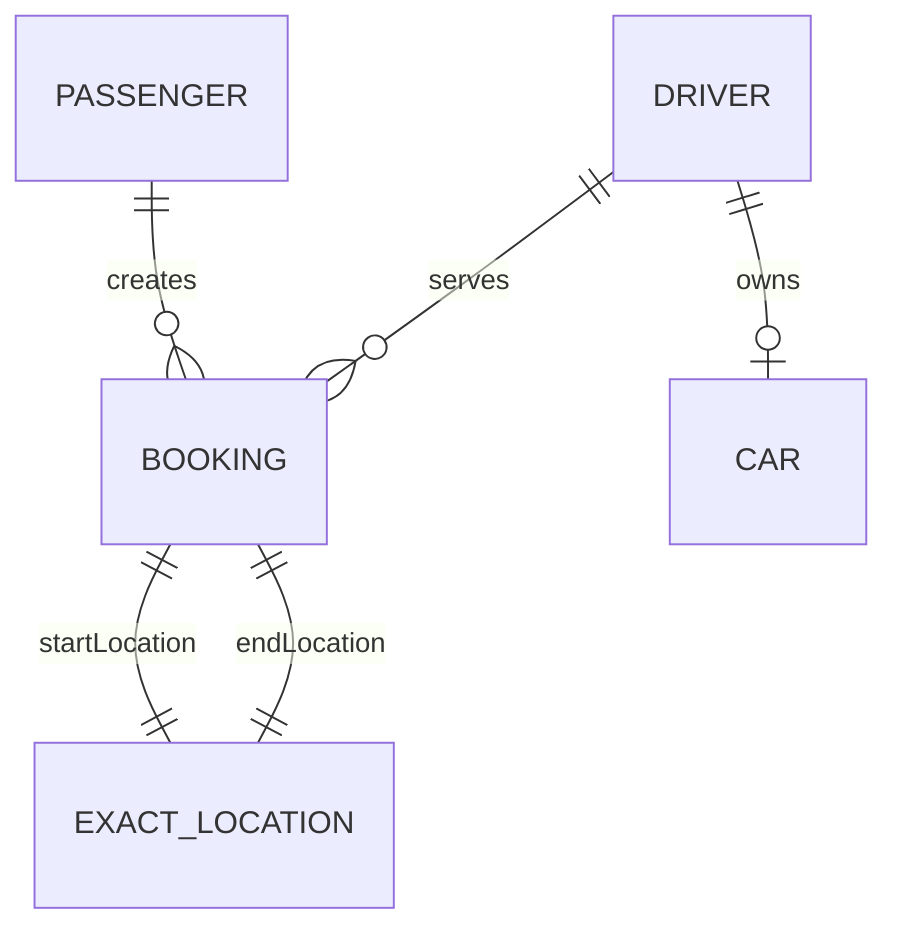

# RideFlow Entity Service

`Rideflow-EntityService` is RideFlow's **shared domain-model library**.

Despite the repository name, this module is primarily a reusable Maven artifact rather than a network-facing microservice.

Other RideFlow services consume its JPA entities and enums so they share the same domain vocabulary and persistence model.

---

## Maven Coordinates

Current artifact:

```text
group:    com.rideflow
artifact: Rideflow-EntityService
version:  0.0.7-SNAPSHOT
```

Consumer example:

```gradle
repositories {
    mavenCentral()
    mavenLocal()
}

dependencies {
    implementation 'com.rideflow:Rideflow-EntityService:0.0.7-SNAPSHOT'
}
```

---

## Why This Module Exists

Several RideFlow services need the same core domain concepts:

```text
Passenger
Driver
Booking
BookingStatus
ExactLocation
Review
Car
Role
```

Without a shared model, every service could independently define these classes and gradually introduce incompatible fields, relationships, or enum values.

For this project, EntityService acts as the common model contract.

---

## Domain Models

| Model             | Purpose                                                           |
| ----------------- | ----------------------------------------------------------------- |
| `BaseModel`       | Common ID and auditing fields                                     |
| `Passenger`       | Passenger/account information                                     |
| `Driver`          | Driver identity, rating, availability, location and relationships |
| `Car`             | Driver vehicle information                                        |
| `Booking`         | Ride booking connecting passenger, driver and locations           |
| `ExactLocation`   | Latitude and longitude                                            |
| `NamedLocation`   | Named geographic location                                         |
| `Review`          | Base review entity                                                |
| `PassengerReview` | Passenger-specific review subtype                                 |
| `OTP`             | One-time-password persistence model                               |

---

## Important Enums

The shared library also defines enums used across RideFlow:

```text
BookingStatus
Role
CarType
Color
DriverApprovalStatus
```

Current booking statuses include:

```text
ASSIGNING_DRIVER
SCHEDULED
ASSIGNED_DRIVER
CAB_ARRIVED
STARTED
IN_RIDE
COMPLETED
CANCELED
```

Current roles:

```text
PASSENGER
DRIVER
ADMIN
```

---

## Simplified Domain Relationships



A booking currently connects:

```text
Passenger
Driver
Start Location
End Location
Booking Status
Ride Times
Distance
```

---

## Current Consumer Versions

| Service          | EntityService version |
| ---------------- | --------------------- |
| Auth Service     | `0.0.7-SNAPSHOT`      |
| Booking Service  | `0.0.7-SNAPSHOT`      |
| Review Service   | `0.0.7-SNAPSHOT`      |
| Socket Server    | `0.0.7-SNAPSHOT`      |
| Location Service | `0.0.4-SNAPSHOT`      |

> Location Service is still pinned to an older EntityService snapshot on its current `main` branch.

If a service expects an older snapshot, that exact artifact must be available in Maven Local or the service dependency must be updated after confirming compatibility.

---

## Build

### Linux / macOS

```bash
./gradlew clean build
```

### Windows

```bash
gradlew.bat clean build
```

---

## Publish to Maven Local

The repository uses Gradle's `maven-publish` plugin.

### Linux / macOS

```bash
./gradlew publishToMavenLocal
```

### Windows

```bash
gradlew.bat publishToMavenLocal
```

After publication, services configured with:

```gradle
repositories {
    mavenCentral()
    mavenLocal()
}
```

can resolve the shared artifact.

---

## Typical Development Workflow

When changing a shared entity or enum:

```text
Modify EntityService
        ↓
Build/Test EntityService
        ↓
Publish snapshot to Maven Local
        ↓
Update consumer dependency if needed
        ↓
Rebuild consumer services
        ↓
Verify database/schema compatibility
```

For example:

```gradle
implementation 'com.rideflow:Rideflow-EntityService:0.0.7-SNAPSHOT'
```

---

## Why Version Changes Matter

A shared-model change can affect multiple areas at once.

For example, adding or modifying an entity field can affect:

* Java compilation
* JSON serialization/deserialization
* Hibernate mappings
* database columns
* foreign-key relationships
* nullability
* enum persistence
* Swagger-generated schemas
* application startup

Because of this, EntityService snapshot changes should be treated as compatibility changes rather than only Java-code changes.

---

## Persistence Support

The module includes support for:

* Spring Data JPA
* Hibernate
* MySQL
* Flyway
* Bean Validation
* JPA auditing

The project also contains database migration resources used for the shared persistence schema.

---

## Database

Local development is based around:

```text
jdbc:mysql://localhost:3306/uberdb
```

Create the database when needed:

```sql
CREATE DATABASE uberdb;
```

Because multiple RideFlow services use the shared entity model and database during development, schema compatibility is important.

---

## Swagger / OpenAPI

Swagger is intentionally **not required** in this repository.

EntityService does not define RideFlow business REST controllers.

Its normal role is:

```text
Build Library
     ↓
Publish Maven Artifact
     ↓
Consume From Other Services
```

API documentation belongs to the services exposing HTTP endpoints, such as:

```text
Auth Service
Booking Service
Review Service
Socket Server
```

---

## Technology Stack

* Java 17
* Spring Boot 4.1.1
* Spring Data JPA
* Hibernate
* MySQL
* Flyway
* Bean Validation
* Lombok
* Gradle
* Maven Publish

---

## Project Structure

```text
src/main/java/com/rideflow/rideflowentityservice/
├── RideflowEntityServiceApplication.java
└── models/
    ├── BaseModel.java
    ├── Booking.java
    ├── BookingStatus.java
    ├── Car.java
    ├── CarType.java
    ├── Color.java
    ├── Driver.java
    ├── DriverApprovalStatus.java
    ├── ExactLocation.java
    ├── NamedLocation.java
    ├── OTP.java
    ├── Passenger.java
    ├── PassengerReview.java
    ├── Review.java
    └── Role.java
```

Resources include:

```text
src/main/resources/
├── application.properties
└── db/migration/
```

---

## Architectural Trade-Off

Using a shared JPA entity library makes development easier for this learning project because every service works with the same model.

However, it also increases coupling.

For example:

```text
EntityService change
        ↓
Booking Service affected
        ↓
Review Service affected
        ↓
Auth Service affected
        ↓
Socket Service affected
```

In a more independently deployed production microservice architecture, each service would typically own its persistence model and communicate through versioned:

* DTOs
* REST contracts
* events
* messages

That allows services to evolve more independently.

---

## Parent Project

See the complete RideFlow platform:

[RideFlow](https://github.com/Abhilash-Panja/RideFlow)
