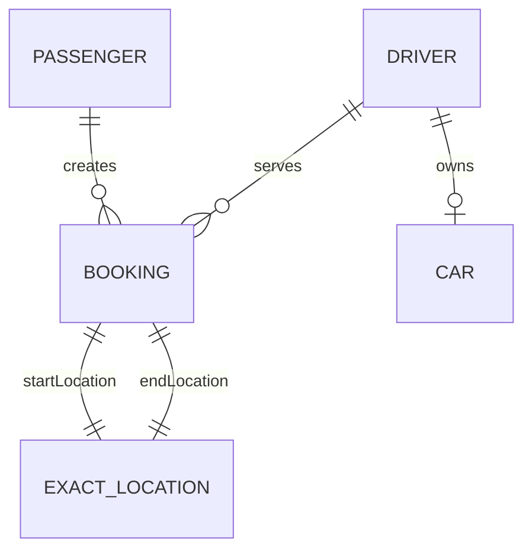

# RideFlow Entity Service

`Rideflow-EntityService` is RideFlow's **shared domain-model library**. Despite the repository name, its primary purpose is not to expose a network API. Instead, it packages common JPA entities and enums and publishes them as a Maven artifact consumed by other RideFlow services.

## Maven Coordinates

Current repository version:

```text
group:    com.rideflow
artifact: Rideflow-EntityService
version:  0.0.5-SNAPSHOT
```

Consumer example:

```gradle
repositories {
    mavenCentral()
    mavenLocal()
}

dependencies {
    implementation 'com.rideflow:Rideflow-EntityService:0.0.5-SNAPSHOT'
}
```

## Why This Module Exists

Multiple RideFlow services need the same domain vocabulary:

- booking status
- passengers and drivers
- cars
- geographic locations
- reviews
- roles
- driver approval states

Keeping those classes in one published library avoids duplicating entity definitions across every repository.

## Domain Model

| Model | Purpose |
|---|---|
| `BaseModel` | Shared identifier/auditing base |
| `Passenger` | Passenger account/domain data |
| `Driver` | Driver identity, availability, rating, city and relationships |
| `Car` | Driver vehicle information |
| `Booking` | Ride booking linking passenger, driver and locations |
| `ExactLocation` | Latitude/longitude coordinates |
| `NamedLocation` | Named geographic location |
| `Review` | Base review model |
| `PassengerReview` | Passenger-specific review subtype |
| `OTP` | One-time-password related model |

Important enums include:

- `BookingStatus`
- `Role`
- `CarType`
- `Color`
- `DriverApprovalStatus`

Current `BookingStatus` values are:

```text
STARTED
CANCELED
CAB_ARRIVED
ASSIGNED_DRIVER
IN_RIDE
SCHEDULED
ASSIGNING_DRIVER
COMPLETED
```

Current roles are:

```text
PASSENGER
DRIVER
ADMIN
```

## Booking Relationships

A `Booking` currently contains:

- `startTime`
- `endTime`
- `totalDistance`
- `bookingStatus`
- `Driver`
- `Passenger`
- `startLocation`
- `endLocation`

Simplified relationship view:



## Build and Publish Locally

The repository uses Gradle's `maven-publish` plugin.

### Build

```bash
# Linux/macOS
./gradlew clean build

# Windows
gradlew.bat clean build
```

### Publish to Maven Local

```bash
# Linux/macOS
./gradlew publishToMavenLocal

# Windows
gradlew.bat publishToMavenLocal
```

After publishing, consuming services with `mavenLocal()` can resolve the artifact.

## Important Version Compatibility Note

The RideFlow repositories currently do not all use the same EntityService snapshot:

| Service | Pinned version |
|---|---|
| Auth Service | `0.0.2-SNAPSHOT` |
| Review Service | `0.0.2-SNAPSHOT` |
| Location Service | `0.0.4-SNAPSHOT` |
| Socket Server | `0.0.4-SNAPSHOT` |
| Booking Service | `0.0.5-SNAPSHOT` |

If you are setting up the full platform on a clean machine, align these versions or make the required historical snapshots available.

Because JPA entities are shared, changing fields, nullability, relationships or enum values can affect several services and the database schema at once. Treat a model-version bump as a compatibility change.

## Persistence and Migrations

The project contains:

```text
src/main/resources/db/migration/
└── V1__initial_db_setup.sql
```

and includes Spring Data JPA, Flyway, MySQL and validation dependencies.

Local application configuration currently points to:

```text
jdbc:mysql://localhost:3306/uberdb
```

The library can be launched as a Spring Boot application, but normal RideFlow usage is to **build/publish it and consume it from other services**.

## Project Structure

```text
src/main/java/com/rideflow/rideflowentityservice/
├── RideflowEntityServiceApplication.java
└── models/
    ├── BaseModel.java
    ├── Booking.java
    ├── BookingStatus.java
    ├── Car.java
    ├── CarType.java
    ├── Color.java
    ├── Driver.java
    ├── DriverApprovalStatus.java
    ├── ExactLocation.java
    ├── NamedLocation.java
    ├── OTP.java
    ├── Passenger.java
    ├── PassengerReview.java
    ├── Review.java
    └── Role.java

src/main/resources/
├── application.properties
└── db/migration/
```

## API Documentation

There are no RideFlow REST controllers in this repository, so Swagger/OpenAPI is not required here.

## Design Consideration

Sharing JPA entities is convenient for this learning project, but in a larger independently deployed microservice architecture, services often own their persistence models and exchange versioned DTO/event contracts instead. That reduces schema coupling between independently deployed services.

## Parent Project

See the complete platform:

[RideFlow](https://github.com/Abhilash-Panja/RideFlow)
